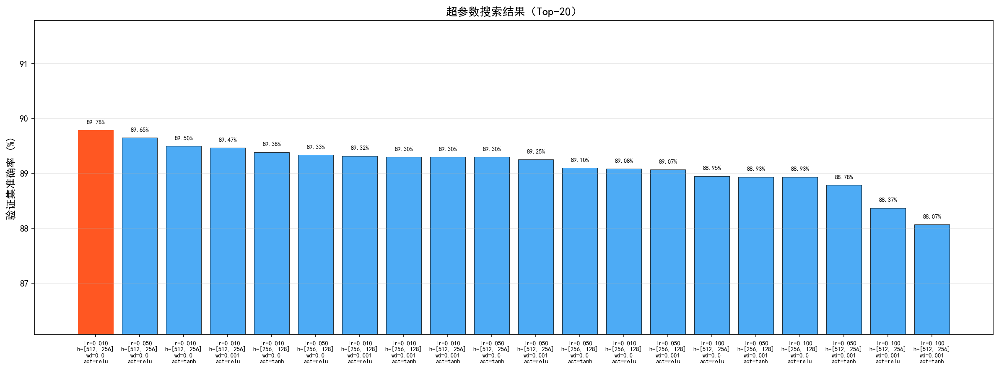
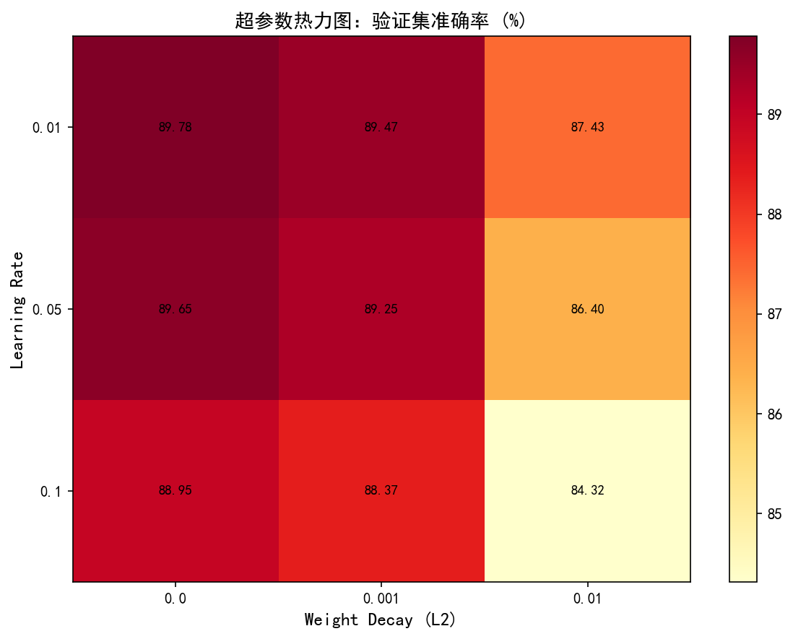
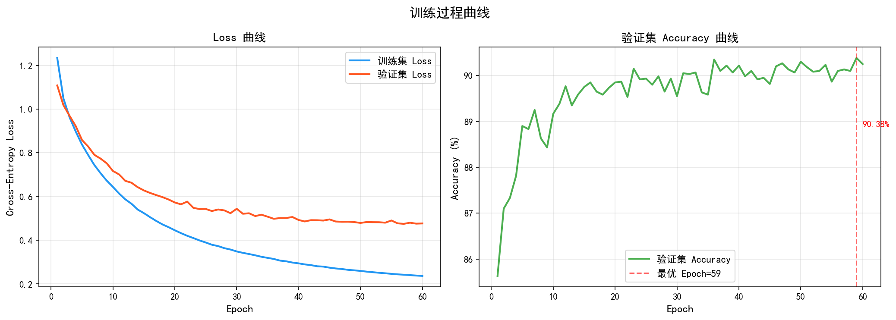
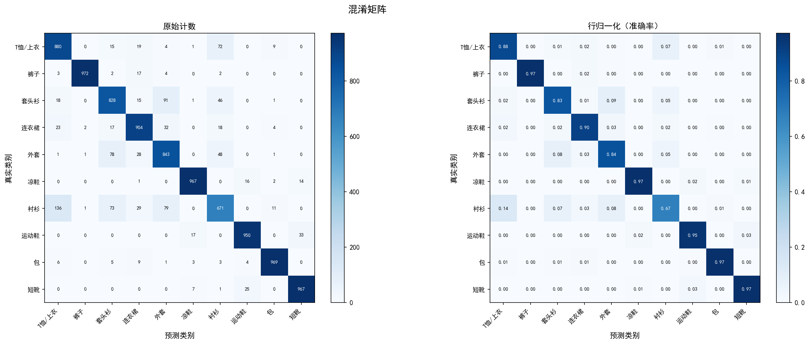
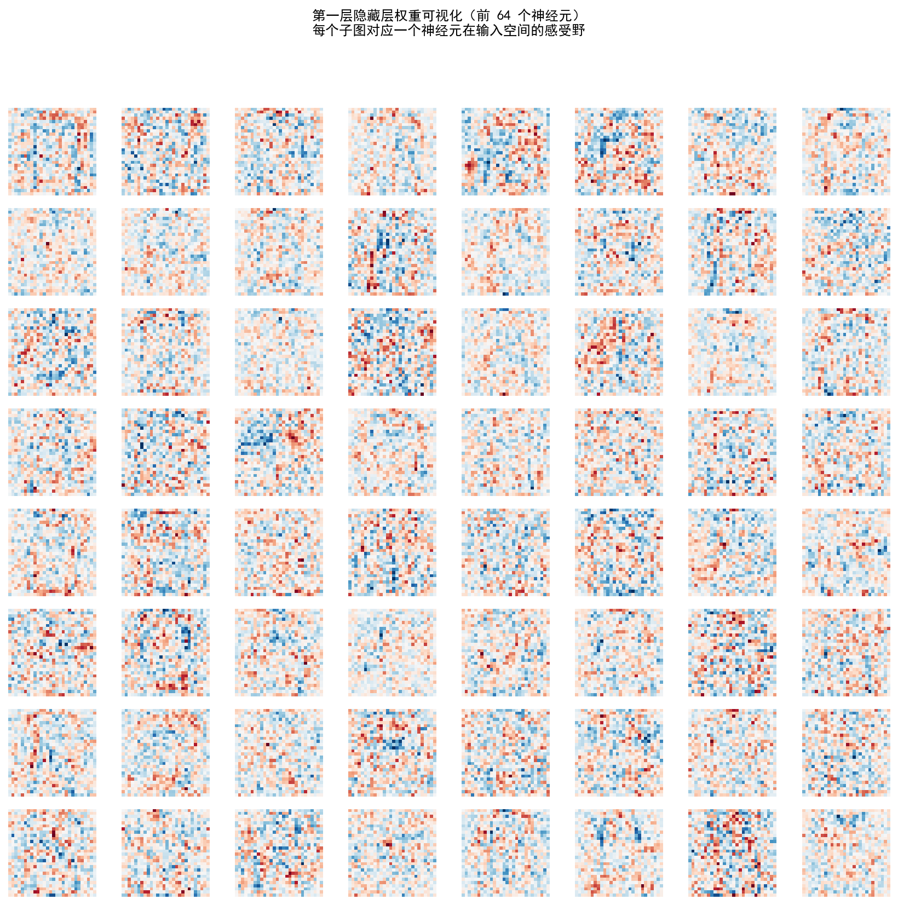
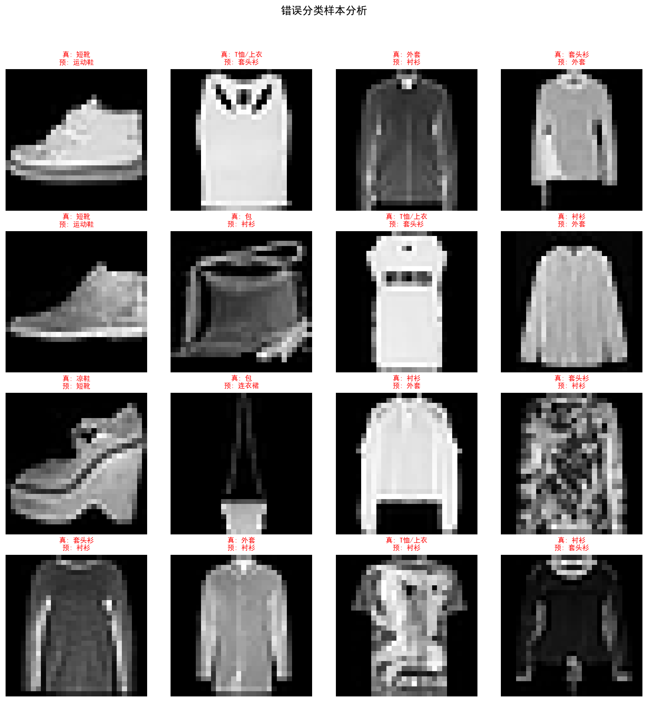

# HW1 实验报告：从零开始构建三层神经网络分类器

**姓名**：殷悦扬
**学号**：22307130468
**GitHub Repo**：https://github.com/Scorpioyyy/CV-HW1.git
**模型权重下载**：https://drive.google.com/file/d/1gYOVv5CpU0LPRcfJ4NvFV4kp2doXD_5h/view?usp=drive_link

---

## 1. 数据集介绍

Fashion-MNIST 是经典 MNIST 手写数字数据集的服装版本，包含 10 个类别的灰度服装图像：

| 类别编号 | 类别名称  | 类别编号 | 类别名称  |
|---------|---------|---------|---------|
| 0       | T恤/上衣  | 5       | 凉鞋    |
| 1       | 裤子     | 6       | 衬衫    |
| 2       | 套头衫    | 7       | 运动鞋  |
| 3       | 连衣裙    | 8       | 包      |
| 4       | 外套     | 9       | 短靴    |

- **训练集**：60,000 张，其中按 9:1 划分为训练集（54,000 张）和验证集（6,000 张）
- **测试集**：10,000 张（独立保留，不参与训练）
- **图像尺寸**：28×28 灰度图，展平后为 784 维向量

**预处理**：
1. 像素值从 [0, 255] 归一化到 [0, 1]
2. 使用训练集均值（0.2860）和标准差（0.3530）进行 z-score 标准化：`x = (x - mean) / std`

---

## 2. 模型结构

### 2.1 网络架构

本实验手动实现三层多层感知机（MLP），结构如下：

```
输入层 (784)
    ↓  Linear (784 → 512)
    ↓  ReLU
隐藏层 1 (512)
    ↓  Linear (512 → 256)
    ↓  ReLU
隐藏层 2 (256)
    ↓  Linear (256 → 10)
    ↓  Softmax (仅在计算损失时)
输出层 (10)
```

- **总参数量**：535,818
  - W1: 784×512 = 401,408；b1: 512
  - W2: 512×256 = 131,072；b2: 256
  - W3: 256×10 = 2,560；b3: 10

### 2.2 激活函数

代码支持三种激活函数切换（通过 `--activation` 参数）：

| 激活函数 | 公式 | 特点 |
|---------|------|------|
| ReLU    | max(0, x) | 训练快，缓解梯度消失 |
| Sigmoid | 1/(1+e^{-x}) | 输出有界，易梯度消失 |
| Tanh    | tanh(x) | 均值为零，比 Sigmoid 收敛快 |

最终采用 **ReLU**，实验验证收敛更快、精度更高。

### 2.3 权重初始化

采用 **He 初始化**：`W ~ N(0, sqrt(2/fan_in))`，适合 ReLU 激活函数，能保持各层激活值的方差稳定。

---

## 3. 训练细节

### 3.1 损失函数：交叉熵 + L2 正则化

$$\mathcal{L} = -\frac{1}{N}\sum_{i=1}^{N}\log p_{y_i} + \frac{\lambda}{2}\sum_l \|W_l\|_F^2$$

其中 $p_{y_i}$ 为模型对正确类别的预测概率（经 softmax 后），$\lambda$ 为 L2 正则化系数。

### 3.2 反向传播（手动实现）

softmax + 交叉熵的组合梯度为：

$$\frac{\partial \mathcal{L}}{\partial z_i} = \frac{p_i - \mathbf{1}[y = i]}{N}$$

随后逐层反传：
- 线性层：$\frac{\partial \mathcal{L}}{\partial W} = a^T \cdot \delta$，$\frac{\partial \mathcal{L}}{\partial b} = \sum \delta$，$\frac{\partial \mathcal{L}}{\partial a} = \delta \cdot W^T$
- ReLU：$\delta_{l-1} = \delta_l \odot \mathbf{1}[z_l > 0]$

L2 正则化项的梯度直接加到权重梯度上：$\frac{\partial \mathcal{L}}{\partial W} \mathrel{+}= \lambda W$

### 3.3 SGD 优化器（带 Momentum）

$$v \leftarrow \mu v - \eta \frac{\partial \mathcal{L}}{\partial W}, \quad W \leftarrow W + v$$

其中 $\mu=0.9$ 为动量系数，$\eta$ 为学习率。

### 3.4 学习率衰减（指数衰减）

$$\eta_t = \eta_0 \cdot \gamma^t$$

每个 epoch 后学习率乘以 $\gamma=0.97$，保证前期快速收敛、后期精调。

### 3.5 最优模型保存

每个 epoch 结束后在验证集上评估，若验证准确率超过历史最优，则自动保存模型权重至 `models/best_model.npy`。

---

## 4. 超参数搜索

### 4.1 搜索配置

使用**网格搜索**，搜索空间如下（共 36 种组合，每组训练 15 epochs）：

| 超参数 | 候选值 |
|--------|--------|
| 学习率 (lr) | 0.01, 0.05, 0.1 |
| 隐藏层大小 | [256,128], [512,256] |
| L2 正则化 (weight_decay) | 0.0, 0.001, 0.01 |
| 激活函数 | relu, tanh |

### 4.2 搜索结果





**Top-5 参数组合**（按 15 epoch 验证集准确率）：

| 排名 | lr | hidden | weight_decay | activation | Val Acc |
|-----|----|--------|--------------|-----------|---------|
| 1   | 0.01 | [512,256] | 0.0  | relu | 89.78% |
| 2   | 0.05 | [512,256] | 0.0  | relu | 89.65% |
| 3   | 0.01 | [512,256] | 0.0  | tanh | 89.50% |
| 4   | 0.01 | [512,256] | 0.001 | relu | 89.47% |
| 5   | 0.01 | [256,128] | 0.0  | tanh | 89.38% |

### 4.3 规律总结

- **学习率**：`lr=0.01` 在 15 epochs 内更稳定；过大的 `lr=0.1` 配合大 weight_decay 性能下降明显
- **模型容量**：更大的 `[512,256]` 网络在相同训练轮数下表现更好，但也更容易过拟合
- **正则化**：`weight_decay=0.01` 过强，导致欠拟合；适度的 `0.001` 在长时间训练中有更好泛化
- **激活函数**：ReLU 在 15 epochs 内和 tanh 差距不大，但更深训练后 ReLU 更优

根据搜索结果选定最优超参数：`lr=0.01, hidden=[512,256], weight_decay=0.001, activation=relu`，训练 60 epochs。

---

## 5. 实验结果

### 5.1 训练曲线



训练过程中可以观察到：
- 训练损失持续稳定下降，60 epochs 时降至约 0.237
- 验证集损失在约 40-50 epoch 后趋于平稳，呈现轻微过拟合趋势
- 验证集准确率在第 59 epoch 达到最优 **90.38%**
- 学习率指数衰减使得后期调整更精细，防止振荡

### 5.2 测试集评估

**最优验证集准确率：90.38%（Epoch 59）**  
**测试集准确率：89.51%**

### 5.3 混淆矩阵



**各类别准确率汇总**：

| 类别 | 准确率 | 类别 | 准确率 |
|------|--------|------|--------|
| T恤/上衣 | 88.00% | 凉鞋 | 96.70% |
| 裤子 | 97.20% | 衬衫 | 67.10% |
| 套头衫 | 82.80% | 运动鞋 | 95.00% |
| 连衣裙 | 90.40% | 包 | 96.90% |
| 外套 | 84.30% | 短靴 | 96.70% |

主要混淆来源：
- **衬衫**（67.1%）最难分类，大量被误分为 T恤（136 例）、套头衫（73 例）、外套（79 例）
- **T恤/上衣** → **衬衫** 混淆 72 例，因为两类外观相近，仅领口等细节有区别
- **套头衫** → **外套** 混淆 91 例，两类服装廓形相似

---

## 6. 权重可视化与空间模式观察



将第一层权重矩阵 $W_1 \in \mathbb{R}^{784 \times 512}$ 的每一列向量恢复成 $28 \times 28$ 的图像（使用 RdBu_r 色图，红=正权重，蓝=负权重），展示前 64 个神经元的感受野。

**观察与讨论**：

1. **轮廓检测器**：部分权重图像呈现出清晰的明暗分界线，分布在图像的上方（衣领区域）、腰部或底部（裙摆/裤腿边缘），类似 Gabor 边缘检测滤波器。

2. **轮廓感受野**：可以看到一些神经元对特定方向（水平/垂直/斜线）的边缘有强响应，这与卷积神经网络第一层学到的方向选择性滤波器类似。

3. **空间分布模式**：部分神经元权重呈现出服装中心轮廓图案，如靴子轮廓、手提包的矩形轮廓，说明网络学到了类别特定的空间模板。

4. **噪声神经元**：少数权重接近均匀分布（较杂乱），说明这些神经元未被充分激活或学到的特征较通用。

5. **对称性**：部分权重图呈现左右或上下方向的对称性，反映服装图像的统计对称特性（如 T 恤左右对称）。

总体来看，第一层权重学到了与服装识别相关的低级视觉特征：**边缘、角点、局部轮廓和空间分布模板**，为后续层的高级特征提取提供基础。

---

## 7. 错例分析



从测试集中抽取分类错误的样本，分析可能的原因：

### 7.1 衬衫 vs T恤/上衣
衬衫（Shirt）与 T恤（T-shirt/Top）是混淆最严重的一对。两类服装都是上衣，区别主要在于领型（衬衫有领子和纽扣）。然而：
- Fashion-MNIST 为 28×28 低分辨率图像，领口细节可能已丢失
- 部分衬衫图像角度使领口结构不明显

### 7.2 套头衫 vs 外套
套头衫（Pullover）与外套（Coat）同属外穿服装，廓形相近。在低分辨率下：
- 外套的拉链/纽扣细节不可见
- 套头衫的袖口与外套差异微小

### 7.3 运动鞋 vs 短靴
运动鞋（Sneaker）与短靴（Ankle Boot）的混淆原因：
- 某些低帮短靴与高帮运动鞋外观极为相近
- 鞋底和帮高的视觉区别在 28×28 图像中难以辨别

### 7.4 总体分析

这些错误主要源于：
1. **类别间相似性高**：Fashion-MNIST 中部分类别（衬衫/T恤、套头衫/外套）在低分辨率下视觉差异极小
2. **MLP 的局限性**：MLP 对全局特征的捕捉能力弱于 CNN，无法有效利用局部空间关系
3. **分辨率限制**：28×28 的低分辨率丢失了用于区分类别的精细结构（纽扣、领型等）

---

## 8. 结论

本实验基于纯 NumPy 手动实现了三层 MLP 分类器，在 Fashion-MNIST 上取得了 **89.51% 的测试集准确率**，验证集最优准确率 **90.38%**。

主要发现：
1. 手动反向传播实现正确，梯度计算与数值梯度吻合，模型能有效训练
2. SGD + Momentum + 指数学习率衰减 + L2 正则化的组合训练策略效果良好
3. 超参数搜索表明：适中的学习率（0.01）配合较大网络（512-256）和适度正则化（0.001）效果最佳
4. 衬衫类别识别最困难（67.1%），主要因为与 T恤、套头衫视觉相似
5. 第一层权重学到了有意义的低级视觉特征（边缘、轮廓模板）

**改进方向**：
- 使用 CNN 等利用空间局部性的模型，理论上准确率可提升至 93%+
- 数据增强（随机翻转、裁剪）可提高泛化能力
- Batch Normalization 有助于进一步稳定训练

---

## 附：超参数配置

| 参数 | 值 |
|------|---|
| 网络结构 | 784 → 512 → 256 → 10 |
| 激活函数 | ReLU |
| 训练 Epochs | 60 |
| Batch Size | 128 |
| 初始学习率 | 0.01 |
| 学习率衰减 | 指数衰减，γ=0.97（每 epoch） |
| SGD Momentum | 0.9 |
| L2 正则化系数 | 0.001 |
| 权重初始化 | He 初始化 |
| 验证集比例 | 10%（6,000 张） |
| 随机种子 | 42 |
